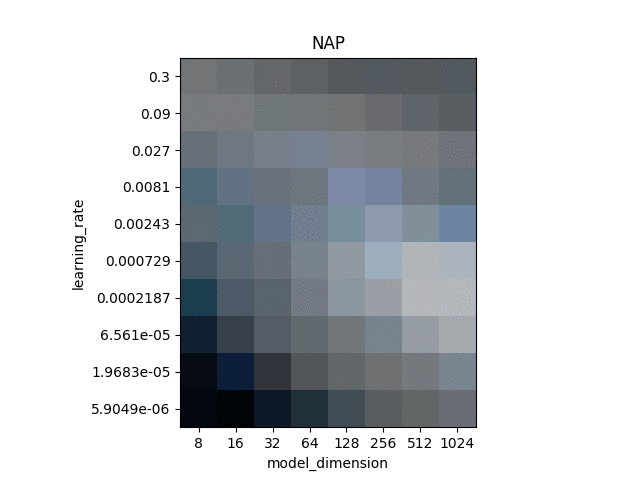
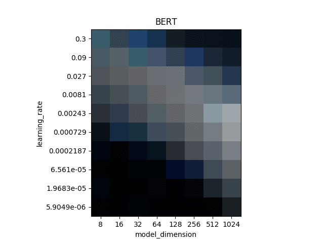

# Normalized Attention Pooling

This repository contains the code and results of the experiments presented in the paper 
"Normalized Attention Without Probability Cage".

## Setup
Requirements: Conda (https://docs.conda.io/en/latest/)

Clone/Download the code repository and install and activate the conda environment with

```bash
conda env create -f conda_environment.yml
conda activate nap
```
## Exploring paper results
Run the 'display.py' script to explore the results of the models and variations presented in the paper.
Run
```bash
python display.py -h
```
to see the available options. The script also allows to animate the evolution of results over the course of training:



## Training
If you wish to reproduce the results or train your own variation, you can use the 'train.py' script.
Run
```bash
python train.py -h
```
to see the available options. For the reinforcement learning experiments we provide a separate shell script in the wmg_agent subfolder.
